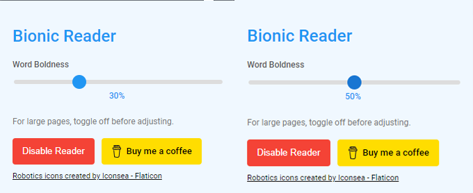
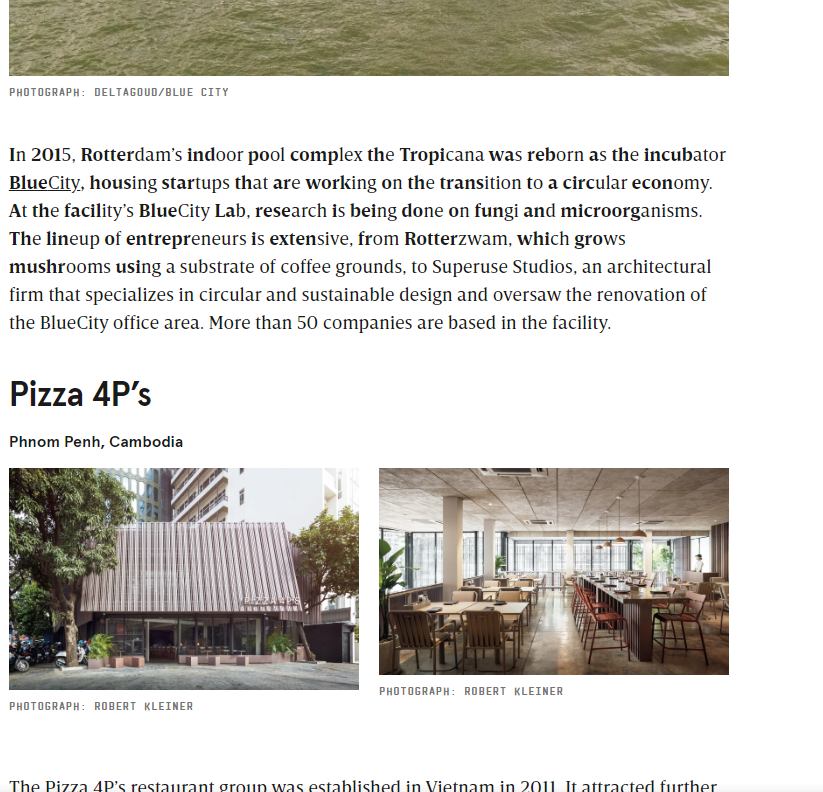
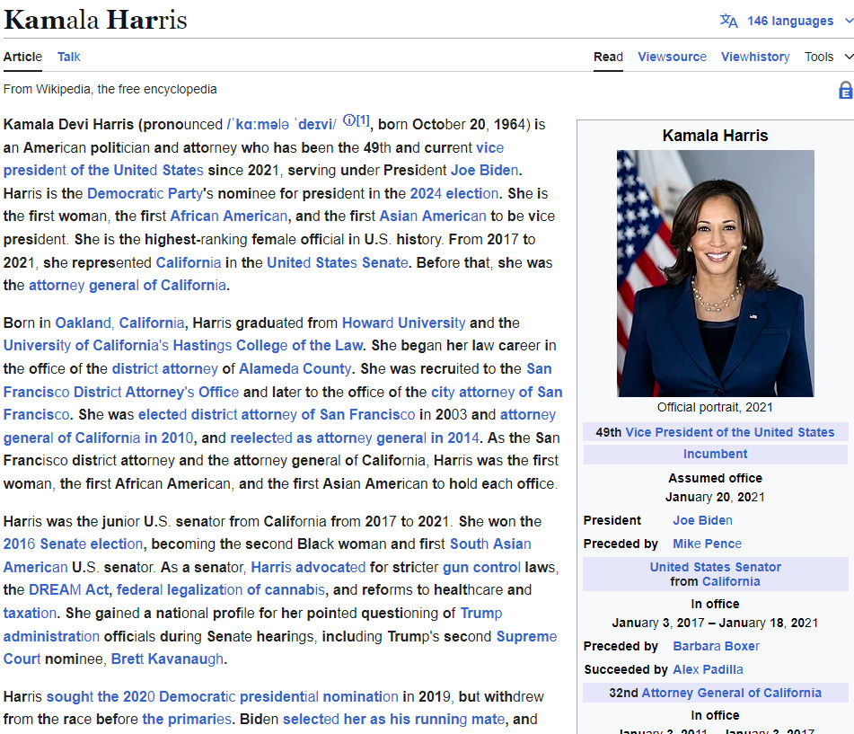
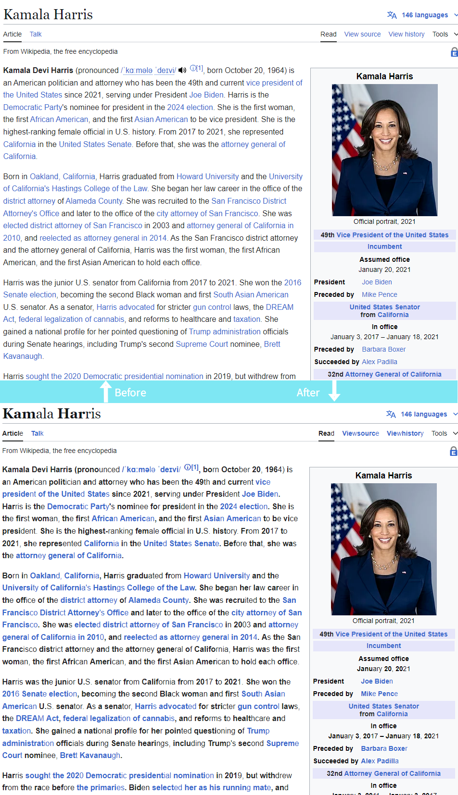

# SwiftSight

> Transform any web text into an effortlessly readable format with this Chrome extension that employs bionic reading techniques.

SwiftSight enhances your reading experience by highlighting key parts of words, allowing your brain to naturally complete them. This simple yet powerful tool helps readers with ADHD and anyone looking to improve their reading speed and comprehension.

## Features

- 🚀 One-click activation for entire webpage transformation
- ⚙️ Customizable bionic intensity with real-time preview
- ✨ Smart text selection through context menu
- 🎯 Adjustable highlighting ratio for each word
- 💨 Instant processing with no page reload required
- 🎨 Clean, non-intrusive visual enhancement
- 🧠 Reduces cognitive load while reading

## Screenshots

### Customization Popup

_Adjust the bionic reading intensity using an intuitive slider_

### Context Menu Integration

_Right-click any selected text to apply bionic reading through the context menu_

### Full Page Transformation

_Transform entire web pages with your preferred settings_

### Before & After Comparison

_See the difference in readability with SwiftSight_

## Customization Options

- **Bionic Intensity Slider**: Control how much of each word is highlighted (25% - 75%)
- **Context Menu Integration**: Right-click selected text for quick transformation
- **Persistent Settings**: Your preferred intensity settings are saved between sessions

## Why SwiftSight?

Reading shouldn't be a struggle. SwiftSight uses proven bionic reading patterns to guide your eyes through text naturally, making reading more efficient and less taxing on your attention span. Perfect for students, professionals, and anyone who wants to enhance their reading experience.

---

_SwiftSight: Read smarter, not harder._
